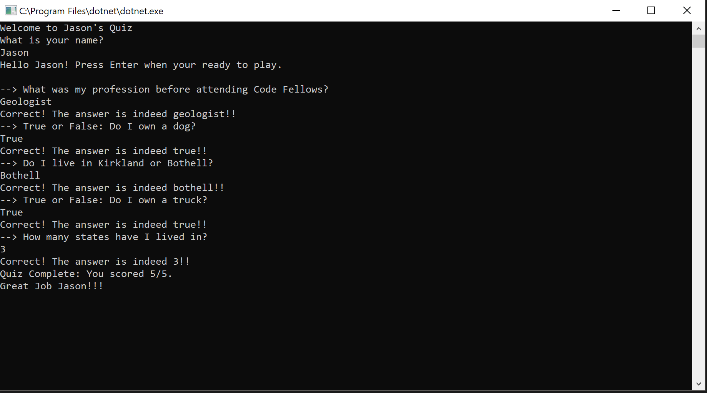

# Calculator
 - Create a Calculator. Use everything that you have learned from the prework tutorials.

- Create a very basic, 4 function calculator within a console application.

## Specs
- Upon completion, your calculator should contain the following:

- Inside the Program.cs file of your console application you should have 4 external methods plus the Main method:
  	- Add()
	- Subtract()
	- Multiply()
	- Divide()
- Each of these methods should take in 2 parameters, and return the solution of those 2 numbers. (i.e if you are adding 2 numbers than your return would be the sum of the 2 numbers added together. )

Output to the console the answer to the proposed math problem.

## Example Output
- When you run app.
    - Welcome to Jason's C# Calculator:
    - Select 1 for Addition
    - Select 2 for Subtract
    - Select 3 for Multiplication
    - Select 4 for Division
    
 - When you input:
	- 1 

   - Returns:
       - "What numbers would you like to add together?"
       
       - When you input:
       	- 1 
       	
       	- Returns:
       	        - You Selected 1. You have 1 choices left.
       	        
       - When you input:
            - 2
            
           - Returns:
                - You Selected 2. You have 0 choices left.
                - Your solution is 3.
         
 
## Screenshot of Output

